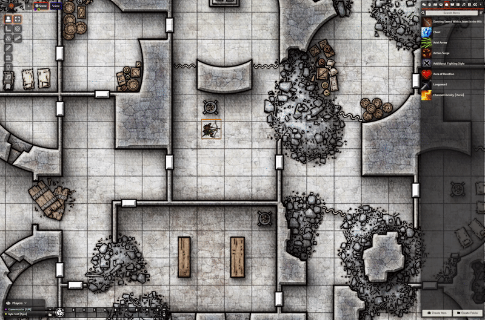
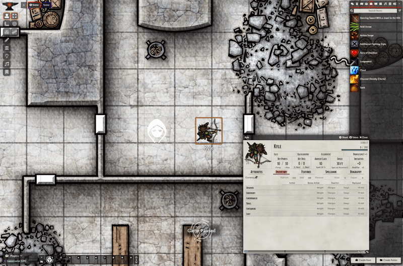

# Introduction

Pick-Up-Stix allows you to create items as Tokens that players can pick up. It will automatically add the items to the player's inventory.

## Features
- Drop items from the Items directory
- Drop items from the compendiums without importing them
- Create containers out of dropped items, lock them, add open and closed images
- Players may pick items up
- Players may drop items from their own inventories onto the map that other players can pick up
- Drop Items directly onto a Token to add it to the actor's inventory
- Drag items from an Actor's inventory onto another Token to transfer the item to that Actor's inventory

## Limitations
- Player's must be within one square of the item in order to pick it up (not configurable at the moment)
- Player's must control one and only one token when picking up an item

## Known Issues

- HUD does not update until you close and re-open the HUD
- Actors dragged directly from the compendium (not impoted and added from the actors directory) will display the pickup HUD option when they should not

# Demos

## Drop an item from the `items directory`

## Disguise magic items as normal items

## Allow one item to represent multiple items

## Drop items directly from compendiums without importing them

## Create containers that open and close

## Create containers that can't be closed once opened

## Create locked containers that must be unlocked before players can open them

## Drop Items directly onto Tokens or from an Actor's inventory to the map or other Tokens

